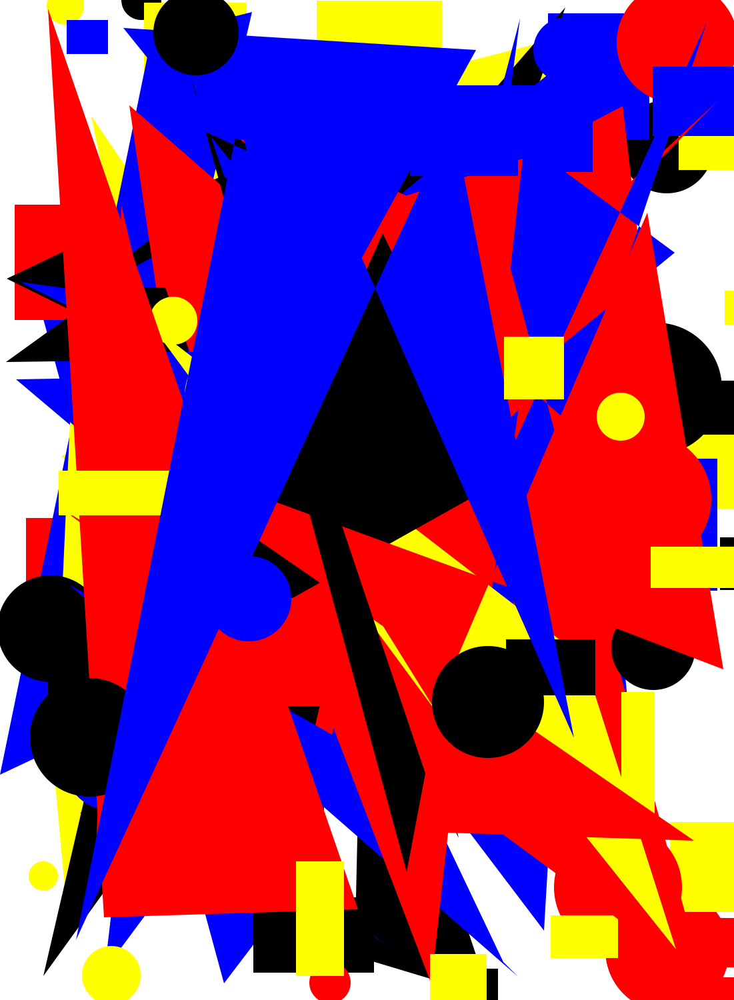
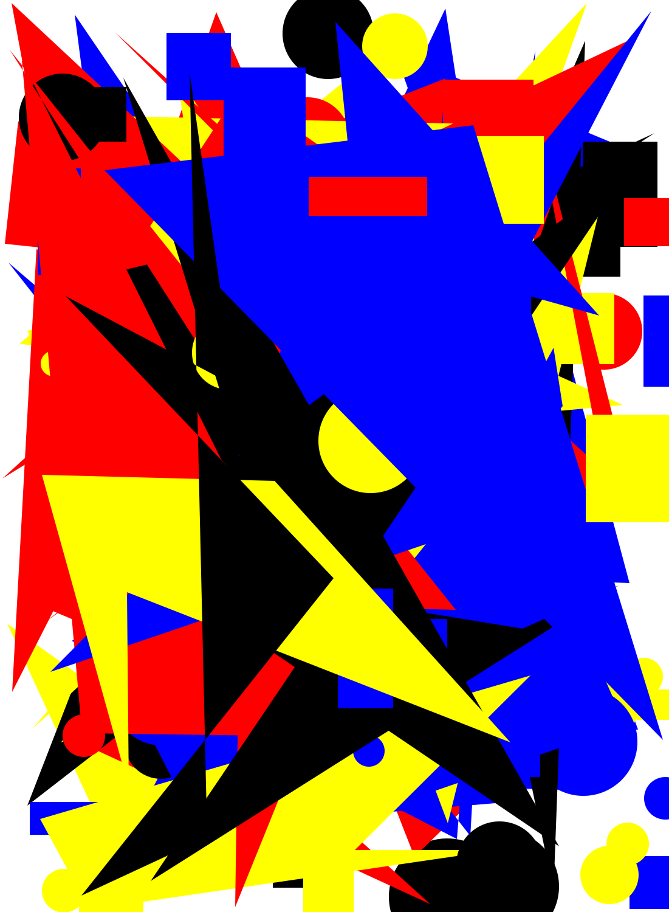
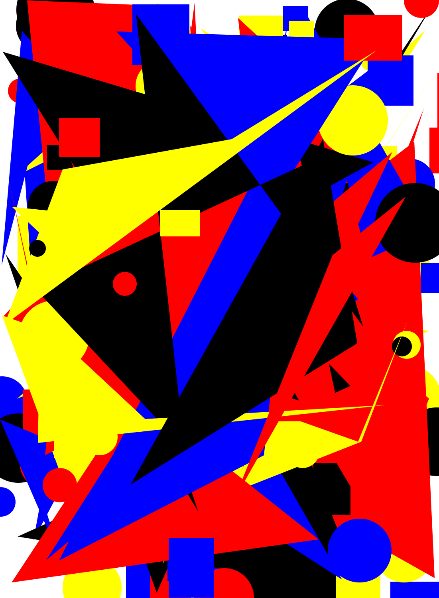

+++
title = "Maurice Estève, formes et ChatGPT"
date = 2024-11-30
description = """
Je cherchais à illustrer un futur article.
J'ai demandé à ChatGPT de me générer une forme en HTML/CSS inspirée de De Stijl. Le résultat était assez catastrophique...
Je lui ai à la place demandé de générer un script python générant des formes aléatoires, basées sur une peinture de Maurice Estève.
"""
+++


### Le prompt

```
can you generate an svg, inspired by this painting
```

Voilà l'image :


### Le script

Ci-dessous le script généré, très légèrement remanié pour fonctionner en local :

```py
import random
from PIL import Image
import numpy as np

# Open the uploaded image
image_path = "./image.jpg"
image = Image.open(image_path)

# Convert the image to RGB
image_rgb = image.convert("RGB")

# Convert the image to numpy array for analysis
image_array = np.array(image_rgb)

# Check the shape of the image to understand its dimensions
image_array.shape


# Define a function to generate random colors similar to the ones in the image
def generate_random_color():
    return f"rgb({random.randint(100, 255)}, {random.randint(50, 200)}, {random.randint(50, 255)})"

# Define a function to create a simple SVG structure with abstract shapes
def generate_svg(width, height, num_shapes=10):
    svg_header = (
        f'<svg xmlns="http://www.w3.org/2000/svg" width="{width}" height="{height}">'
    )
    svg_footer = "</svg>"

    # Generate random abstract shapes
    shapes = ""
    for _ in range(num_shapes):
        shape_type = random.choice(["circle", "rect", "polygon"])

        if shape_type == "circle":
            cx = random.randint(0, width)
            cy = random.randint(0, height)
            r = random.randint(20, 100)
            shapes += f'<circle cx="{cx}" cy="{cy}" r="{r}" fill="{generate_random_color()}" />'

        elif shape_type == "rect":
            x = random.randint(0, width)
            y = random.randint(0, height)
            w = random.randint(50, 200)
            h = random.randint(50, 200)
            shapes += f'<rect x="{x}" y="{y}" width="{w}" height="{h}" fill="{generate_random_color()}" />'

        elif shape_type == "polygon":
            points = [
                f"{random.randint(0, width)},{random.randint(0, height)}"
                for _ in range(random.randint(3, 6))
            ]
            points_str = " ".join(points)
            shapes += (
                f'<polygon points="{points_str}" fill="{generate_random_color()}" />'
            )

    return svg_header + shapes + svg_footer


# Generate the SVG with the dimensions of the uploaded image
svg_content = generate_svg(image.width, image.height, num_shapes=15)

svg_path = f"./generated_artwork-{i}.svg"
with open(svg_path, "w") as file:
    file.write(svg_content)
```

Je l'ai retouché pour n'afficher que certaines couleurs, car le première version proposait des couleurs un peu trop ternes.

```py

def generate_random_color():
    # Define basic colors and their corresponding RGB values
    basic_colors_rgb = {
        "red": (255, 0, 0),
        # "green": (0, 255, 0),
        "blue": (0, 0, 255),
        "yellow": (255, 255, 0),
        "black": (0, 0, 0),
        # "white": (255, 255, 255),
        # "orange": (255, 165, 0),
        # "purple": (128, 0, 128),
        # "pink": (255, 192, 203),
        # "brown": (165, 42, 42),
    }

    # Select a random color
    color_name = random.choice(list(basic_colors_rgb.keys()))

    # Get the RGB value and format it as 'rgb(r, g, b)'
    rgb_value = basic_colors_rgb[color_name]
    return f"rgb{rgb_value}"
```

Et ai ajouté une boucle pour générer une centaine de résultats en faisant varier le nombre de formes

```py
for i in range(1, 99):
    # Generate the SVG with the dimensions of the uploaded image
    svg_content = generate_svg(image.width, image.height, num_shapes=i * 2)

    svg_path = f"./generated_artwork-{i}.svg"
    with open(svg_path, "w") as file:
        file.write(svg_content)
```

J'aurais certainement pu aboutir à un résultat similaire en me creusant un peu la tête...mais ça m'aurait certainement pris quelques heures de plus.

---


## Le résultat











