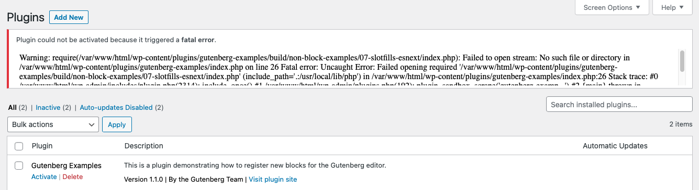

+++
title = "WordPress: a few thoughts and tips"
date = 2023-03-30
description = ""
+++

Wordpress is not so popular among developers[^1]. However, its market share[^2] is undebatable.

I had to work with WordPress recently for [WWOOF](https://asso.wwoof.fr)[^3] with a headless setup : 
* Wordpress as a blog and static pages provider  
* a Next.js frontend consuming its data
       
My experience with Wordpress is quite outdated: it dates back to ~2010.   
**I wanted to share a few thoughts about how it felt using it in 2023. This is not a detailed and honest comparison.**

## Documentation is fine, once you found it

First thing : I searched **Wordpress get started** on search engines.   
Almost every result feels like people trying to sell you something. Quite the opposite of most open source communities I am used to.  
Just add **developer** to this query and you will feel at home.

In fact, the _documentation_ is located in the [**developpers** section](https://developer.wordpress.org) of the documentation's website.  
WordPress's primary focus are the editors. It makes sense that what they call a _documentation_ is not the technical documentation. Still, not usual but not an issue per se.
   
Many API reference pages have a comment section in which some people post examples of implementation.  
That is common in php official documentation and can help using an unknown library or function.

## Some great examples...not without errors 

WordPress team provides [official examples in a GitHub repo](https://github.com/WordPress/gutenberg-examples).
  
It seems perfect to get a working local developement setup : 
* Docs are straightforward : `npm run env:start`
* Oops...an error is displayed directly in the console

```php
Stack trace:
#0 /var/www./html/wp-admin/includes/plugin.php(2314): include_once()
#1 /var/www/html/wp-admin/includes/plugin.php(661):plugin_sandbox_scrape('gutenberg-examp...")
#2 phar:///usr/local/bin/w/vendor/w-cli/extension-command/src/Plugin_Command.php(347): activate_plugin('gutenberg-examp
NULL)
#3 [internal function]: Plugin_Command-›activate(Array, Array)
74 phar:///usr/local/bin/wp/vendor/w-cli/w-cli/php/w_CLI/Dispatcher/CommandFactory.php(100): call_user_func(Array, Array, Array)
#5 [internal function]: WP_CLI\Dispatcher\CommandFactory::WP_CLI\Dispatcher\{closure}(Array,Array)
#6 phar:///usr/local/bin/wp/vendor/wp-cli/wp-cli/php/wP_CLI/Dispatcher/Subcommand.php(491): call_user_func(Object(Closure), Array, Array)
#7 phar: /// usr/local/bin/w/vendor/wp-cli/w-cli/php/NP_CLI/Runner.php(419):WP_CLI\Dispatcher\Subcommand->invoke(Array,Array,Array)
#8 phar:///usr/local/bin/wp/vendor/wp-cli/wp-cli/php/WP_CLI/Runner.php(442): WP_CLI\Runner->run_command(Array,Array)
#9 phar:///usr/local/bin/w/vendor/wp-cli/wp-cli/php/w_CLI/Runner.php(1256) : WP_CLI\Runner-›run_command_and_exit()
#10 phar:///usr/local/bin/w/vendor/wp-cli/wp-cli/php/WP_CLI/Bootstrap/LaunchRunner.php(28): WP_CLI\Runner-›start()
#11 phar:///usr/local/bin/wp/vendor/wp-cli/wp-cli/php/bootstrap.php(78): W_CLI\Bootstrap\LaunchRunner-›process(Object(WP_CLI\Bootstrap\BootstrapState))
#12 phar:///usr/local/bin/w/vendor/wp-cli/wp-cli/php/wp-cli.php(32): WP_CLI\bootstrap()
#13 phar:///usr/local/bin/wp/php/boot-phar.php (11): include 'phar: ///usr/loc ...
")
#14 /usr/local/bin/wp(4): include( phar: ///usr/loc
")
#15 {main}
thrown in /var/www/html/w-content/plugins/gutenberg-examples/index.phponline16
```

Let's dig: this example uses [this dependency](https://www.npmjs.com/package/@wordpress/env) to set up a local development environment: a node package…that runs…docker ?  

* WordPress is a php project, that relies on node.js mainly for Gutenberg and assets bundling.  
* Why not just a docker-compose.yml file ? It could be useful to non-nodejs-but-docker-savvy PHP developpers
  
It always feel a bit sketchy some framework obfuscate the underlying technologies behind some of their tools.  
It could easily save them time spent with support request if they just included a `docker-compose.yml` and a few references to docker documentation. 

## ...it escalated quickly...

By checking running containers (`docker ps`), I noticed that the wordpress server was running and accessible on [http://localhost:8888](.).

Let's ignore the error for now and enable the example plugin.   

On the plugins page, a cryptic error is now displayed. 

Here we find the same stack trace as before…that starts with the word **warning** (?)  
Looking a bit closer, there is a `Fatal Error` message in the middle of the little message at the top of the page.  
You want to see more ? Let’s…scroll in this small `div` ?  
I can’t believe that they did not find a better way to display a stack trace in the admin. Maybe this is me that did not find it though 😬 ?

After a few minutes spent debugging, I read several GitHub issues and some clear proofs that this package is not properly maintained :   
* [A comment from a developper from Automattic saying that they removed some tests because it added friction to core commits and PRs](https://github.com/WordPress/gutenberg/issues/48678#issuecomment-1453191368)
* [A lot of open issues (49 open vs 71 closed at the time of writing)](https://github.com/WordPress/gutenberg/issues?q=is%3Aopen+is%3Aissue+label%3A%22%5BPackage%5D+Env%22)

This is where I gave up.  
I ended up not using this project to set up my local development environment but instead wrote my own `docker-compose.yml`, that is really simple : 

```yml 
services:
  db:
    image: mariadb:10.6.4-focal
    command: "--default-authentication-plugin=mysql_native_password"
    volumes:
      - db_data:/var/lib/mysql
    restart: unless-stopped
    environment:
      - MYSQL_ROOT_PASSWORD=somewordpress
      - MYSQL_DATABASE=wordpress
      - MYSQL_USER=wordpress
      - MYSQL_PASSWORD=wordpress
    expose:
      - 3306
      - 33060
  wordpress:
    image: wordpress:latest
    ports:
      - 8000:80
    restart: unless-stopped
    environment:
      - WORDPRESS_DEBUG=1
      - WORDPRESS_DB_HOST=db
      - WORDPRESS_DB_USER=wordpress
      - WORDPRESS_DB_PASSWORD=wordpress
      - WORDPRESS_DB_NAME=wordpress
    volumes:
      #  This is our custom plugin, you can put yours here
      - ./wordpress/wwoof-blocks/:/var/www/html/wp-content/plugins/wwoof-blocks/
      # If you need to customized your php config
      - ./php.ini:/usr/local/etc/php/php.ini
volumes:
  db_data:
```

---

[^1]: [https://insights.stackoverflow.com/survey/2020#technology-most-loved-dreaded-and-wanted-platforms-dreaded5](https://insights.stackoverflow.com/survey/2020#technology-most-loved-dreaded-and-wanted-platforms-dreaded5)
[^2]: [https://kinsta.com/wordpress-market-share/](https://kinsta.com/wordpress-market-share/)
[^3]: An organization that links people to organic farmers to educate about ecological farming practices.
[^4]: I started with Spip a long time ago, then drupal, then cool headless cms like prismic, and more recently Wagtail that is Django base. If you do not know about [Wagtail](https://wagtail.org), you should definitely check it out. I have worked with this CMS in various projects, and this is my go-to CMS each time I need to build project with a great editor experience in mind.
